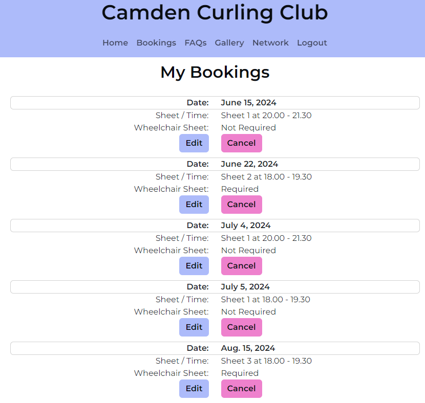
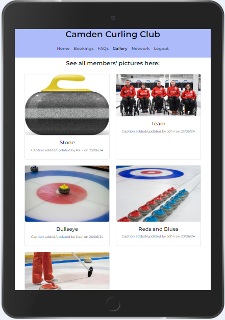

# [CAMDEN CURLING CLUB](https://camden-curling-club-286959c89917.herokuapp.com)

## Project Purpose

The purpose of this project is to create a members' hub for the fictional Camden Curling Club where members can book practice sessions and engage with club activities.

New users will be able to register for membership and members will be able to book practice sessions, read FAQs, upload images to a gallery and access a curling club network.

The site administrator will be able to monitor and modify all aspects of the site including member access and bookings, approving gallery images and adding content to the FAQs and curling club network.

## Target Audience

The target audience is existing and potential members of the Camden Curling Club.


## UX
### Initial Design and Wireframes

For small screens I wanted to centre the content and I present here the primary wireframes for each page: [WIREFRAMES.md](WIREFRAMES.md).

For larger screens the content, where appropriate, will display as three columns from left to right and I present here the relevant wireframes.

### Colour Scheme

Design and colour should enhance, not distract, so I wanted to adopt a clean and simple design with pastel-shade colours on a primarily white background, thus allowing the text and images to be the focus.

I therefore chose a soft lavender for the primary background colour along with a similar shade of pink for onscreen messages, button-hover and secondary-button functions.

Black, blue and green text were chosen to provide variety and a clear contrast with the white background.

I used the [W3 RGB](https://www.w3schools.com/colors/colors_rgb.asp) calculator to select colours, and their use is summarised below:

- `rgb(10, 13, 17)` used for primary text.
- `rgb(173, 187, 250)` used for header, footer and primary buttons.
- `rgb(238, 129, 205)` used for onscreen messages, button-hover and secondary buttons.
- `rgb(0, 0, 255)` and `rgb(0, 128, 0)` for text on FAQs and Network pages for contrast.

### Typography

- [Montserrat](https://fonts.google.com/specimen/Montserrat) is used for all text.

- [Font Awesome](https://fontawesome.com) is used for the social media icons in the footer.

## User Stories

### New Users
- As a new user, I would like to land on an informative and engaging home page so that I can learn about the club.
- As a new user, I would like to submit my contact details so that I can register my membership.

### Site Members
- As a member, I would like to enter my login details so that I can access the members' area.
- As a member, I would like to logout so that I can know my session has been closed securely.
- As a member, I would like to submit a question for display on the FAQs page.
- As a member, I would like to book a practice session so that I can attend at a time that suits me.
- As a member, I would like to amend or cancel a practice session so that I can change my plans.
- As a member, I would like to know if the booking time I want is available so that I can make another choice if necessary.
- As a member, I would like to add images to the gallery so that I can share my curling experiences with other members.

### Site Administrator
- As a site administrator, I would like to access the administrator panel so that I can manage the club membership and site's pages.
- As a site administrator, I would like to know when a new member has registered so that I can email them about their membership options.
- As a site administrator, I would like to manage content on the FAQs page so that I can provide information to members.
- As a site administrator, I would like to approve or delete images added to the gallery so that I can filter out any objectionable material.
- As a site administrator, I would like to manage content on the curling network page so that I can keep members informed of other curling venues.

## Features

### Existing Features

- **Home Page - Public**
    
    - The home page displays the club name in the header along with a navbar to login or register. Three images support clear and engaging text outlining club activities and membership opportunities.


- **Home Page - Members**

    - A message confirms that the member has logged in successfully and the navbar shows the page options.


- **Bookings Page**

    - Members are given clear instructions about the booking process and can submit their booking request via an online form.


- **My Bookings Page**
    - Members can view their current bookings in ascending order of booking date. An Edit and Cancel button allow a booking to be amended or cancelled.



- **FAQs Page**

    - A list of commonly asked questions for new members. This page can be updated through the admin panel


- **Gallery Page**

    - Members can upload their curling images and include a caption. Once submitted, the image is sent for approval by the site administrator and then displayed for all members to see along with the caption and date added/updated. Larger screens display images in rows of up to three columns, tablets two and mobiles one.





- **My Pictures Page**

- Members can view their own uploaded images , edit the caption or delete the image. As above, any edited caption will require approval by the site administrator before display to all.


- **Network Page**

    - Members can access information about other curling clubs across the UK. This page can be updated through the admin panel. Please note that, since all clubs are fictional, for each website I have added a link to the British Curling Association for demonstration purposes.


- **Confirm Logout**

    - When a member logs out they are first asked to confirm this action and are then given an onscreen message confirming that they have logged out.


### Future Features
The following features would add to the user experience:

- Membership Approval & Confirmation
    - A new user will be required to submit additional membership details   via an online form. They will receive an automated email after submission and the site administrator will also receive an automated email giving notice of this application so they can approve membership.

- Enhanced Booking System
    - The bookings system will ensure that double-bookings are avoided by cross-checking bookings and displaying an onscreen message if a time-slot is unavailable.

## Tools & Technologies Used

- [Markdown Builder](https://tim.2bn.dev/markdown-builder) used to generate README and TESTING templates.
- [Git](https://git-scm.com) used for version control. (`git add`, `git commit`, `git push`)
- [GitHub](https://github.com) used for secure online code storage.
- [Gitpod](https://gitpod.io) used as a cloud-based IDE for development.
- [HTML](https://en.wikipedia.org/wiki/HTML) used for the main site content.
- [CSS](https://en.wikipedia.org/wiki/CSS) used for the main site design and layout.
- [JavaScript](https://www.javascript.com) used for user interaction on the site.
- [jQuery](https://jquery.com) used for user interaction on the site.
- [Python](https://www.python.org) used as the back-end programming language.
- [GitHub Pages](https://pages.github.com) used for hosting the deployed front-end site.
- [Heroku](https://www.heroku.com) used for hosting the deployed back-end site.
- [Bootstrap](https://img.shields.io/badge/Bootstrap-grey?logo=bootstrap&logoColor=7952B3) used as the front-end CSS framework for modern responsiveness and pre-built components.
- [Jest](https://jestjs.io) used for automated JavaScript testing.
- [Django](https://www.djangoproject.com) used as the Python framework for the site.
- [PostgreSQL](https://www.postgresql.org) used as the relational database management.
- [Neon](https://neon.tech/) used to host the PostgreSQL database.
- [Cloudinary](https://cloudinary.com) used for online static file storage.
- [WhiteNoise](https://whitenoise.readthedocs.io) used for serving static files with Heroku.
- [Font Awesome](https://fontawesome.com) used for icons.

## Database Design

### Models
In designing the database I developed four models, in addition to Django's User model:
- User (Django)
- Booking
- GalleryImage
- Faqs
- Network

### Entity Relationship Diagrams (ERDs)
I then constructed an ERD for each model:


At project completion I auto-generated a more comprehensive ERD, using `pygraphviz` and `django-extensions`.

These are the steps to follow:
- In the terminal: `sudo apt update`
- Then: `sudo apt-get install python3-dev graphviz libgraphviz-dev pkg-config`
- Then type `Y` to proceed
- Then: `pip3 install django-extensions pygraphviz`
- In `settings.py` file, add the following to `INSTALLED_APPS`:
```python
INSTALLED_APPS = [
    ...
    'django_extensions',
    ...
]
```
- Back in the terminal: `python3 manage.py graph_models -a -o erd.png`
- Drag the new `erd.png` file into `documentation/` folder
- Remove `'django_extensions',` from `INSTALLED_APPS`
- Finally, in the terminal: `pip3 uninstall django-extensions pygraphviz -y`

Source: [medium.com](https://medium.com/@yathomasi1/1-using-django-extensions-to-visualize-the-database-diagram-in-django-application-c5fa7e710e16)


## Project Planning & Agile Development Process

### Project Plan and Milestones

I began with a series of brainstorming sessions and then drew up a project plan which served as milestones for tracking on GitHub.


### GitHub Projects and Issues

[GitHub Projects](https://github.com/Adam-Alive/camden-curling-club/projects) served as an Agile tool for this project.

Through it, epics, user stories, issues, and milestone tasks were planned, then tracked on a weekly basis using the basic Kanban board.

I created two GitHub projects within the repository, and then created issues within each:
- [Curling Club User Stories](https://github.com/users/Adam-Alive/projects/6)
- [Curling Club Development and Testing](https://github.com/users/Adam-Alive/projects/8)

I used my own **User Story Template** to manage user stories and provide an example of a completed issue here:


Progress on each user story was tracked on a weekly basis with overall project-progress monitored on the milestones board, as shown below, where a list of open and closed milestones can be seen:


### MoSCoW Prioritisation

I also used the MoSCow prioritisation model to add labels to my user stories within the Issues tab:

- **Must Have**: guaranteed to be delivered.
- **Should Have**: adds significant value, but not vital.
- **Could Have**: has small impact if left out.
- **Won't Have**: not a priority for this iteration.

A summary of open and closed issues can be accessed via these tabs:

- [](https://github.com/Adam-Alive/camden-curling-club/issues)

- [](https://github.com/Adam-Alive/camden-curling-club/issues?q=is%3Aissue+is%3Aclosed)

## Testing

> For all testing, please refer to the [TESTING.md](TESTING.md) file.

## Deployment

**IMPORTANT:**

> The live application is deployed on Heroku at: [Heroku](https://camden-curling-club-286959c89917.herokuapp.com).

### PostgreSQL Database

This project uses a PostgreSQL database at [Neon](https://neon.tech/).

### Cloudinary API

This project uses the [Cloudinary API](https://cloudinary.com) to store media assets online since Heroku doesn't persist this type of data.

### Heroku Deployment

This project uses [Heroku](https://www.heroku.com), a platform as a service (PaaS) that enables developers to build, run, and operate applications entirely in the cloud.

Deployment steps are as follows, after account setup:

- Select **New** in the top-right corner of your Heroku Dashboard, and select **Create new app** from the dropdown menu.
- Your app name must be unique, and then choose a region closest to you (EU or USA), and finally, select **Create App**.
- From the new app **Settings**, click **Reveal Config Vars**, and set your environment variables.

> [!IMPORTANT]  
> This is a sample only; you would replace the values with your own if cloning/forking my repository.

| Key | Value |
| --- | --- |
| `CLOUDINARY_URL` | user's own value |
| `DATABASE_URL` | user's own value |
| `DISABLE_COLLECTSTATIC` | 1 (*this is temporary, and can be removed for the final deployment*) |
| `SECRET_KEY` | user's own value |

Heroku needs three additional files in order to deploy properly.

- requirements.txt
- Procfile
- runtime.txt

You can install this project's **requirements** (where applicable) using:

- `pip3 install -r requirements.txt`

If you have your own packages that have been installed, then the requirements file needs updated using:

- `pip3 freeze --local > requirements.txt`

The **Procfile** can be created with the following command:

- `echo web: gunicorn app_name.wsgi > Procfile`
- *replace **app_name** with the name of your primary Django app name; the folder where settings.py is located*

The **runtime.txt** file needs to know which Python version you're using:
1. type: `python3 --version` in the terminal.
2. in the **runtime.txt** file, add your Python version:
	- `python-3.9.18`

For Heroku deployment, follow these steps to connect your own GitHub repository to the newly created app:

Either:

- Select **Automatic Deployment** from the Heroku app.

Or:

- In the Terminal/CLI, connect to Heroku using this command: `heroku login -i`
- Set the remote for Heroku: `heroku git:remote -a app_name` (replace *app_name* with your app name)
- After performing the standard Git `add`, `commit`, and `push` to GitHub, you can now type:
	- `git push heroku main`

The project should now be connected and deployed to Heroku!

### Local Deployment

This project can be cloned or forked in order to make a local copy on your own system.

For either method, you will need to install any applicable packages found within the *requirements.txt* file.

- `pip3 install -r requirements.txt`.

You will need to create a new file called `env.py` at the root-level,
and include the same environment variables listed above from the Heroku deployment steps.

> [!IMPORTANT]  
> This is a sample only and you would replace the values with your own if cloning/forking my repository.

Sample `env.py` file:

```python
import os

os.environ.setdefault("CLOUDINARY_URL", "user's own value")
os.environ.setdefault("DATABASE_URL", "user's own value")
os.environ.setdefault("SECRET_KEY", "user's own value")

# local environment only (do not include these in production/deployment!)
os.environ.setdefault("DEBUG", "True")
```

Once the project is cloned or forked, in order to run it locally, you'll need to follow these steps:

- Start the Django app: `python3 manage.py runserver`
- Stop the app once it's loaded: `CTRL+C` or `⌘+C` (Mac)
- Make any necessary migrations: `python3 manage.py makemigrations`
- Migrate the data to the database: `python3 manage.py migrate`
- Create a superuser: `python3 manage.py createsuperuser`
- Load fixtures (if applicable): `python3 manage.py loaddata file-name.json` (repeat for each file)
- Everything should be ready now, so run the Django app again: `python3 manage.py runserver`

#### Cloning

You can clone the repository by following these steps:

1. Go to the [GitHub repository](https://github.com/Adam-Alive/camden-curling-club) 
2. Locate the Code button above the list of files and click it 
3. Select if you prefer to clone using HTTPS, SSH, or GitHub CLI and click the copy button to copy the URL to your clipboard
4. Open Git Bash or Terminal
5. Change the current working directory to the one where you want the cloned directory
6. In your IDE Terminal, type the following command to clone my repository:
	- `git clone https://github.com/Adam-Alive/camden-curling-club.git`
7. Press Enter to create your local clone.

Alternatively, if using Gitpod, you can click below to create your own workspace using this repository:

[Open in Gitpod](https://gitpod.io/#https://github.com/Adam-Alive/camden-curling-club)

Please note that in order to directly open the project in Gitpod, you need to have the browser extension installed.
A tutorial on this can be found [here](https://www.gitpod.io/docs/configure/user-settings/browser-extension).

#### Forking

By forking the GitHub Repository, we make a copy of the original repository on our GitHub account to view and/or make changes without affecting the original owner's repository.
You can fork this repository by using the following steps:

1. Log in to GitHub and locate the [GitHub Repository](https://github.com/Adam-Alive/camden-curling-club)
2. At the top of the Repository (not top of page) just above the "Settings" Button on the menu, locate the "Fork" Button.
3. Once clicked, you should now have a copy of the original repository in your own GitHub account!

## Credits

### Content

| Source | Location | Notes |
| --- | --- | --- |
| [Markdown Builder](https://tim.2bn.dev/markdown-builder) | README and TESTING | An excellent tool to help generate the Markdown files |
| [John Abdsho](https://www.youtube.com/watch?v=s5xbtuo9pR0) | bookings | Initial ideas on how to create a booking system with Django|
| [W3Schools](https://www.w3schools.com/bootstrap5/) | gallery and bookings | Additional support with Bootstrap grids and modals|
| [Scottish Curling](https://www.scottishcurling.org/) |  home and faqs  | Reference  |
| [British Curling](https://www.britishcurling.org.uk/) |  home and faqs  | Reference  |

### Media

| Source | Location | Type | Notes |
| --- | --- | --- | --- |
| [Free Images](https://www.freeimages.com/) | home and gallery | images | Various images of curling |
| [Pexels](https://www.pexels.com/) | home and gallery  | images | Various images of curling  |
| [Pixelied](https://pixelied.com/convert/jpg-converter/jpg-to-webp) | home and gallery  | images | Convert png to webp |

### Acknowledgements

- I would like to thank my Code Institute mentor, [Tim Nelson](https://github.com/TravelTimN), for his invaluable guidance and support throughout the development of this project.
