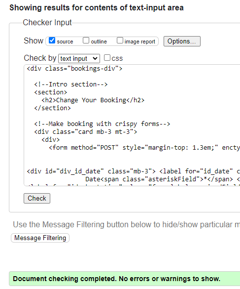
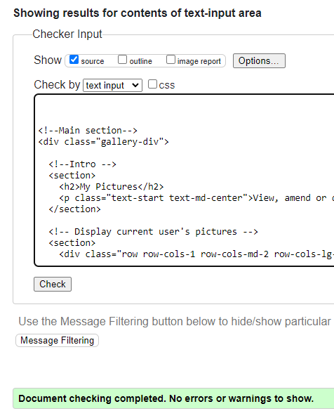
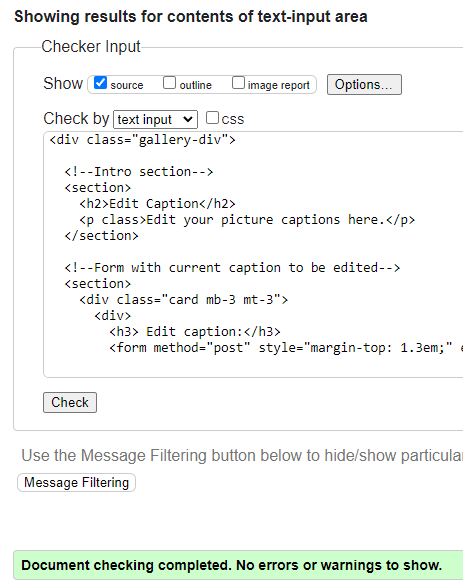
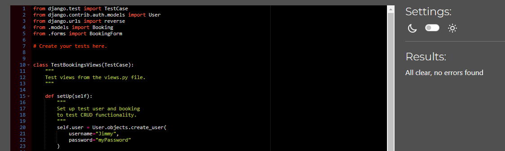
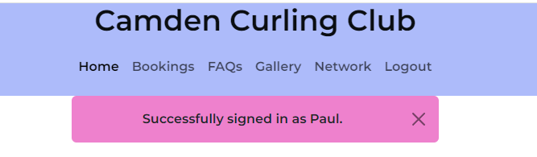
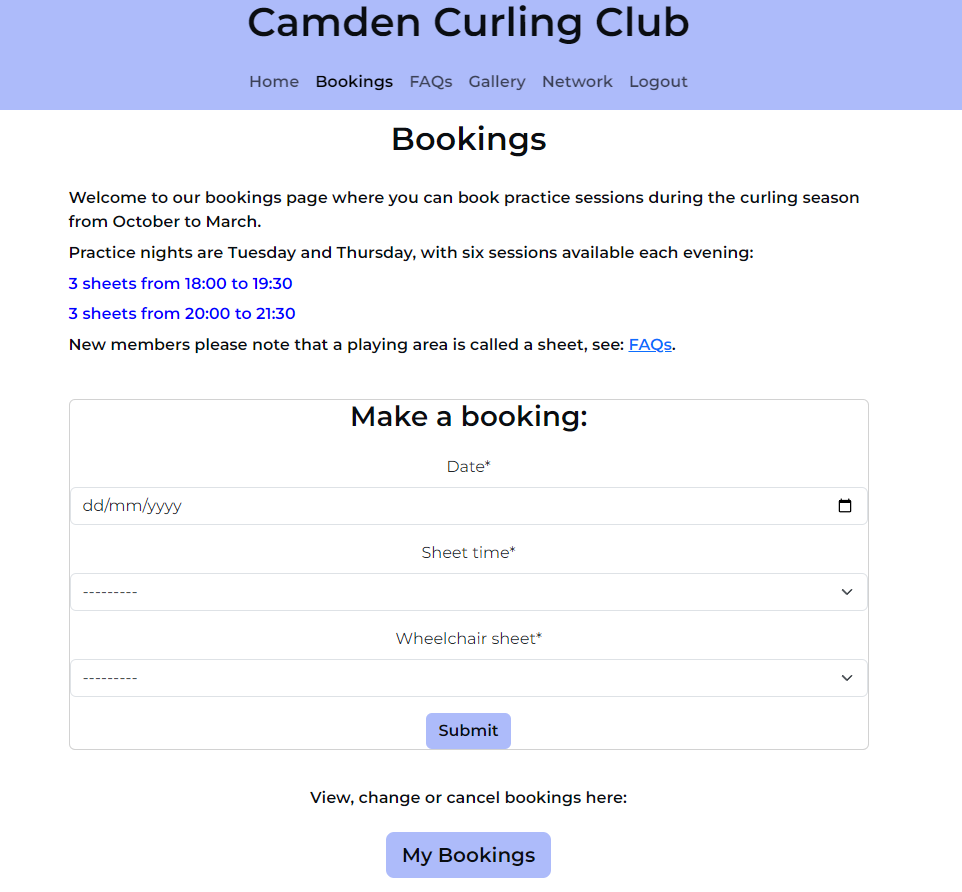
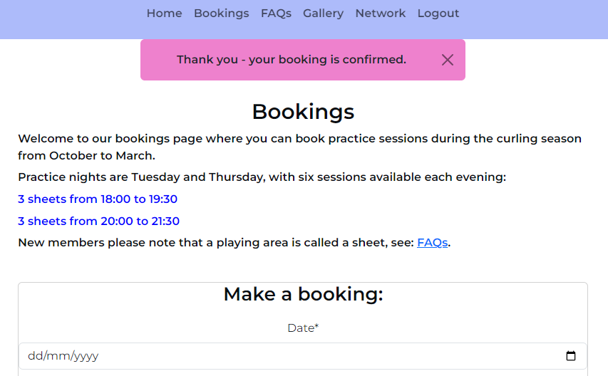
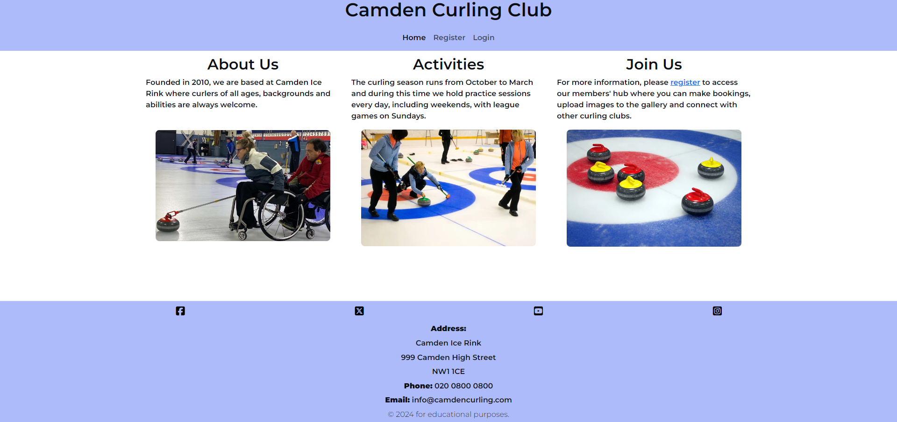
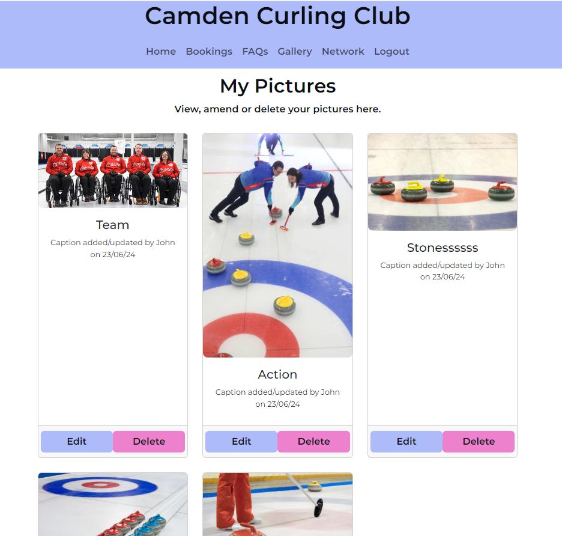
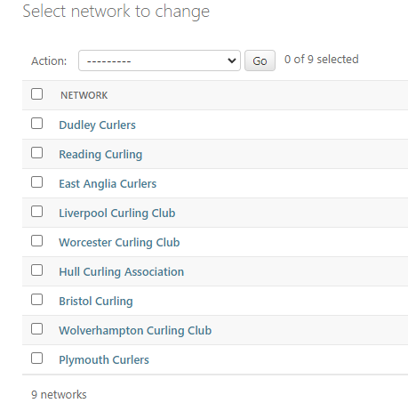

# Testing

> Return to the [README.md](README.md) file.

## Code Validation

### HTML

I have used the recommended [HTML W3C Validator](https://validator.w3.org) to validate all HTML files.

An initial test on the my_bookings.html revealed the following errors:

I realised that I had used the main element on this and all other templates, forgetting that this would be inherited from the base.html - an important learning point. I therefore addressed this for each template, ran all validation tests, and summarise the results below:

| Template | Result| Screenshot | Notes |
| --- | --- | --- | --- |
| index (public) | Pass |  | |
| index (logged-in) | Pass |  | |
| make_bookings | Pass |  | |
| edit_bookings|  Pass|  | |
| my_bookings | Pass |  | |
| faqs | Pass |  | |
| gallery | Pass |  | |
| my_pictures | Pass |  | |
| edit_caption | Pass |  | |
| network|  |  | |
| logout |  |  | |

### CSS

I have used the recommended [CSS Jigsaw Validator](https://jigsaw.w3.org/css-validator) to validate the CSS file.

- Result: Pass, no errors:

  

### JavaScript

I have not undertaken any JS validation since the only scripts used in the base.html are imported from reliable sources ie. Bootstrap and Font Awesome.

### Python

I have used the recommended [PEP8 CI Python Linter](https://pep8ci.herokuapp.com) to validate all Python files.

| File | Screenshot | Notes |
| --- |--- | --- |
| settings.py | | No errors |
| bookings/models.py | | L28, E122 continuation line missing indentation or outdented. This was corrected.|
| bookings/test_forms.py | | no errors |
| bookings/testviews.py | |no errors |
| bookings/urls.py | |no errors |
| bookings/views.py | | no errors|
| faqs/test_views.py | | no errors|
| faqs/urls.py | | no errors|
| faqs/views.py | | no errors|
| faqs/models.py | |no errors |
| gallery/forms.py | | no errors|
| gallery/models.py | |no errrors |
| galery/test_forms.py | |no errors |
| gallery/urls.py | | no errors|
| gallery/views.py | | no errors|
| home/test_views.py | | no errors|
| home/urls.py | |no errors |
| home/views.py | |no errors |
| network/models.py | | no errors|
| network/test_views.py | | Tno errors|
| network/urls.py | |no errors |
| network/views.py | | no errors|

## Browser Compatibility
I've tested my deployed project on Chrome, Edge and Safari to check for compatibility issues.

I tested each browser on the homepage, and then logged in to view each feature. I have provided a summary of these tests below with a screenshot of the homepage or gallery.

| Browser | Home/Gallery | Notes |
| --- | --- | --- |
| Chrome |  | Works as expected |
| Edge |  | Works as expected |
| Safari |  | Works as expected |

## Responsiveness

I deployed the project early on and tested on three of my own devices throughout the development process:

- Moto (g8) power
- HP Desktop (24")
- MacBook Air (13")

I also used Dev Tools to test on a tablet device.

I tested the responsiveness of the homepage and each stage of the game and have provided a summary of these tests below with a screenshot of the home or faqs page.

| Device | Home/Gallery/Faqs | Notes |
| --- | --- | --- |
| Moto(g8) mobile (own) |  | Works as expected |
| Tablet (DevTools) |  | Works as expected |
| MacBook Air (own) |  | Works as expected |
| HP Desktop (own) |  | Works as expected |

## Lighthouse Audit

I tested the deployed project using the Lighthouse Audit tool to check for any major issues and a summary is provided below:

| Page | Mobile | Desktop |
| --- | --- | --- |
| Home |  |  |
| Bookings |  |  | |
| FAQS |  |  |
| Gallery|  |  |
| Network|  |  |
| Logout |  |  |

## Defensive Programming

I conducted manual tests for defensive programming and the Pass/Fail outcomes are summarised below.

| Page / Feature | User Action | Expected Result | Pass/Fail | Comments | Screenshot |
| --- | --- | --- | --- | --- | --- |
| Register | | | | | |
| | Click Register in Navbar. | Registration menu opens. | Pass | |  | |
| | Click Register with any field left blank.| Alert message and registration incomplete. | Pass | |  |
| | Click Register with incorrect email address format.| Alert message and registration incomplete. | Pass | |  |
| | Click Register with all data correct. | Display a successful sign-in message with username and access given to all site features. | Pass | |  |
| Login| | | | | |
| | Click Login in Navbar. | Login menu opens. | Pass | |  |
| | Click Login with any field left blank. | Alert message and login incomplete. | Pass | |  |
| |Click Login with incorrect password (mistakenly or maliciously). | Alert message and login incomplete. | Pass | |  |
| |Click Login with correct password. | Redirect to Home page with login-success message. | Pass | |  |
| Bookings | | | | | |
| | Click Bookings in Navbar. | Redirect to Bookings page with a blank bookings form. | Pass | |  |
| | Click Submit with any field left blank. | Alert message and booking incomplete. | Pass | |  |
| | Click Submit with all data correct.| Display a booking-confirmed message and blank bookings form. | Pass | |   |
| | Click My Bookings. | Redirect to My Bookings page.| Pass | |  |
| My Bookings | | | | | |
| | Click Edit for any booking.| Redirect to Change Your Booking page. | Pass | |  |
| | Click Update with any field left blank. | Alert message and updated booking incomplete. | Pass | |  |
| | Click Update with amended booking data. | Redirect to My Bookings page with a new-booking-confirmed message.| Pass | |  |
| | Click Cancel for any booking. | Pop up modal with Close btn and Cancel Booking btn. | Pass | |  |
| Cancel Modal| | | | | |
| | Click Close. | Pop up closes, My Bookings still displayed.| Pass | |  |
| | Click Cancel Booking. | My Bookings page still displayed along with a your-booking-cancelled message.| Pass | |  |
| FAQs | | | | | |
| | Click FAQs in Navbar.| Redirect to FAQs page. | Pass | |  |
| Gallery | | | | | |
| | Click Gallery in Navbar.	| Redirect to Members' Gallery page. | Pass | |  |
| | Click Submit with Caption field blank. | Alert message and image submission incomplete.| Pass | |  |
| | Click Submit with fields correct.	| Display image-submitted-confirmation message. | Pass | Note Caption: 'Red and green.' Image/caption are subject to approval by the site administrator before display in the gallery - see third screenshot down. Image then displayed - see fourth screenshot down. |     |
| | Click My Pictures. | Redirect to My Pictures page. | Pass | See image with Caption 'Red and Green' |  |
| My Pictures| | | | | |
| | Click Edit. | Edit Caption page is displayed. | Pass | |  |
| | Delete current Caption, leave Caption blank and click Update. | Alert message and image submission incomplete. | Pass | |  |
| | Delete current caption, add new caption and click Update. | Display caption-changed-and-awaiting-approval message. | Pass | |  |
| | Click Delete. | Display modal for user to confirm picture deletion. | Pass | |  |
| Delete Modal | | | | | |
| | Click Close.	| Modal closes, My Pictures displayed. | Pass | |  |
| | Click Delete Picture. | Display My Pictures and your-picture-deleted-message.| Pass | |  |
| Network | | | | | |
| |  Click Network in Navbar. | Redirect to Network page. | Pass | |  |
| Logout| | | | | |
| | Click Logout in Navbar. | Redirect to Logout page. | Pass | |  |
| |  Click Logout. |  Message confirms the current user has logged out. | Pass | |  |
| Admin Portal | | | | | |
| | Append  `/admin` to Home page URL.  | Redirect to Admin portal sign-in. | Pass | |  |
| | Click Login with incorrect username or password – accidentally or maliciously. | Access denied and message displayed. | Pass | Site Admin username not shown for security reasons. |  |
| | Enter correct admin username and password.  | Admin portal accessed.  | Pass | Admin username not shown for security reasons. |  |

## User Story Testing

I conducted manual tests for user stories and a summary is provided below:

| User Story | Screenshot |
| --- | --- |
| As a new user, I would like to land on an informative and engaging home page so that I can learn about the club.|  |
|  As a new user, I would like to submit my contact details so that I can register my membership. |  |
|  As a member, I would like to enter my login details so that I can access the members' area. |  |
|  As a member, I would like to logout so that I can know my session has been closed securely. |   |
|  As a member, I would like to submit a question for display on the FAQs page.| A 'could have' not completed during this iteration. |
|  As a member, I would like to book a practice session so that I can attend at a time that suits me. |  |
|  As a member, I would like to amend or cancel a practice session so that I can change my plans. |  |
| As a member, I would like to know if the booking time I want is available so that I can make another choice if necessary. | A 'could have' not completed during this iteration.|
|  As a member, I would like to add images to the gallery so that I can share my curling experiences with other members. |    |
| As a site administrator, I would like to access the administrator panel so that I can manage the club membership and site's pages. |    |
|  As a site administrator, I would like to know when a new member has registered so that I can email them about their membership options. | A 'won't have' not completed during this iteration. |
|  As a site administrator, I would like to manage content on the FAQs page so that I can provide information to members.|   |
|  As a site administrator, I would like to approve or delete images added to the gallery so that I can filter out any objectionable material.|  |
|  As a site administrator, I would like to manage content on the curling network page so that I can keep members informed of other curling venues. |   |

## Automated Testing

I have conducted a series of automated tests on my application and acknowledge that, in a real-world scenario, an extensive set of additional tests would be required.

### Python (Unit Testing)

I have used Django's built-in unit testing framework to test application functionality.

In order to run the tests, I ran the following command in the terminal each time:

`python3 manage.py test name-of-app `

To create the coverage report, I then conducted the following:

`coverage run --source=name-of-app manage.py test`

`coverage report`

To see the HTML version of the reports, and find out whether some pieces of code were missing, I ran the following commands:

`coverage html`

`python3 -m http.server`

Below are the results from the various apps on my application that I've tested:

| App | File | Coverage | Screenshot |
| --- | --- | --- | --- |
| Bag | test_forms.py | 99% |  |
| Bag | test_models.py | 89% |  |

| Checkout | test_forms.py | 99% |  |
| Checkout | test_models.py | 89% |  |

| Home | test_forms.py | 99% |  |
| Home | test_models.py | 89% |  |

| Products | test_urls.py | 100% |  |
| Products | test_views.py | 71% |  |
| Profiles | test_forms.py | 99% |  |
| Profiles | test_models.py | 89% |  |

| x | x | x | repeat for all remaining tested apps/files |

#### Unit Test Issues

## Bugs

- **Issue:** Favicon only showing on home page.

- **Fix:** Research on Stack Overflow suggested I link to the favicon from the base.html using Django template language, rather than html, and this solved the problem:

    **Before:**

    Favicon displayed on Home page:

      

    Favicon not displayed on Network page:

    

    Original html:

    

    **After:**

    

    Favicon now displayed on all pages:

    

- **Issue:** In developing the My Bookings page, when clicking on 'Edit', the following occurred:

    

- **Fix:** I therefore looked at the `edit_booking` view at line 69:
    
    

    At lines 69 and 77 I changed `booking.user` to `booking.username` to correspond with the `Booking` model:

    

    And then the view worked as expected:

    

    Booking confirmed:

    

- **Issue:** Cancel button not working on My Bookings page - when clicked, nothing happens, so user cannot cancel a booking.

- **Fix:** Investigation in dev tools showed that the actual link was active (the booking was cancelled when clicked) but was not connected to the Cancel button:

    

    I looked at the template `my_bookings.html` and could now see that at line 52/53 I had not included the button code within the anchor element:

    

    Closing anchor tag now added at line 53 and working properly:

    

- **Issue:** Colour flashing when clicking on buttons ie. although I have added my own colour styling to the Bootstrap btn-success and btn-danger buttons, when clicked, there is a brief flash to green and red respectively since these are the default colours.

- **Fix:** I simplified the styling further by creating two button classes of btn-lav (lavender) and btn-pink. I then relabelled all buttons in the appropriate templates. Further testing showed this is now resolved. See style.css:

    

## Unfixed Bugs

> There are no remaining bugs that I am aware of.