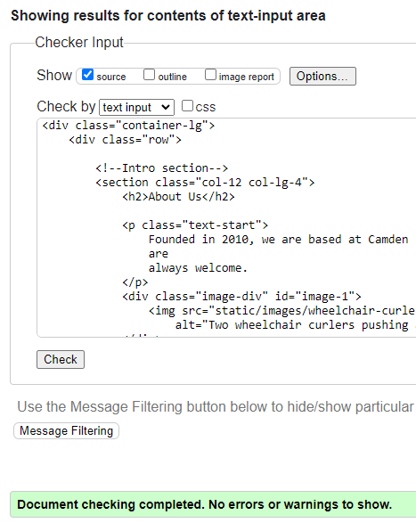
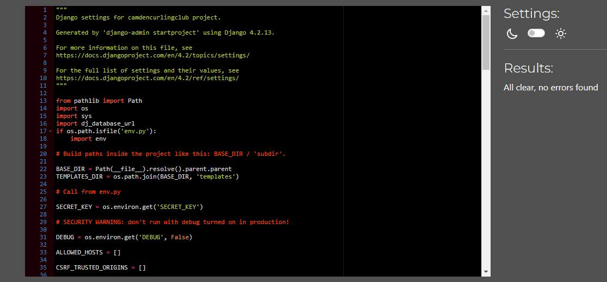
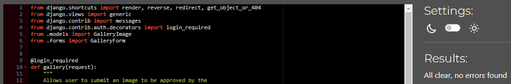
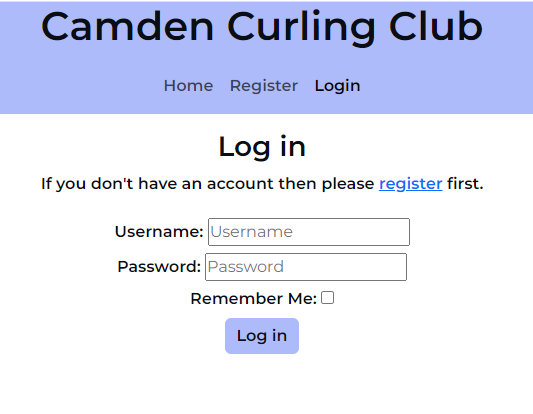
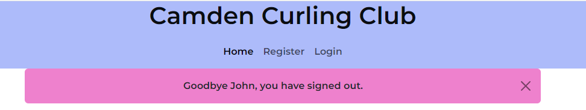
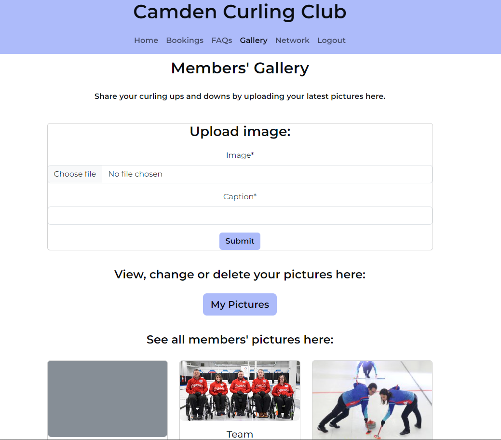

# Testing

> Return to the [README.md](README.md) file.

## Code Validation

### HTML

I have used the recommended [HTML W3C Validator](https://validator.w3.org) to validate all HTML files.

| Template | Result| Screenshot | Notes |
| --- | --- | --- | --- |
| index (public) | Pass |  | Errors due to extension of base.html. |
| index (logged-in) | Pass |  | Errors due to extension of base html. |
| booking_list | Pass |  | | Errors due to extension of base.html.|
| edit_bookings|  Pass|  | Errors due to extension of base.html. |
| my_bookings | Pass |  | Errors due to extension of base.html. |
| faq_list | Pass |  | Errors due to extension of base.html.|
| edit_caption | Pass |  |Errors due to extension of base.html. |
| galleryimage_list | Pass |  | |Errors due to extension of base.html.|
| my_pictures | Pass |  | Errors due to extension of base.html.|
| network_list |  |  | Errors due to extension of base.html. |

### CSS

I have used the recommended [CSS Jigsaw Validator](https://jigsaw.w3.org/css-validator) to validate the CSS file.

- Result: Pass, no errors:

  

### JavaScript

I have not undertaken any JS validation since the only scripts used in the base.html are imported from reliable sources ie. Bootstrap and Font Awesome.

### Python

I have used the recommended [PEP8 CI Python Linter](https://pep8ci.herokuapp.com) to validate all Python files.

| File | Screenshot | Notes |
| --- |--- | --- |
| settings.py | | No errors |
| bookings/models.py | | L28, E122 continuation line missing indentation or outdented. This was corrected.|
| bookings/test_forms.py | | no errors |
| bookings/testviews.py | |no errors |
| bookings/urls.py | |no errors |
| bookings/views.py | | no errors|
| faqs/test_views.py | | no errors|
| faqs/urls.py | | no errors|
| faqs/views.py | | no errors|
| faqs/models.py | |no errors |
| gallery/forms.py | | no errors|
| gallery/models.py | |no errrors |
| galery/test_forms.py | |no errors |
| gallery/urls.py | | no errors|
| gallery/views.py | | no errors|
| home/test_views.py | | no errors|
| home/urls.py | |no errors |
| home/views.py | |no errors |
| network/models.py | | no errors|
| network/test_views.py | | Tno errors|
| network/urls.py | |no errors |
| network/views.py | | no errors|

## Browser Compatibility
I've tested my deployed project on Chrome, Edge and Safari to check for compatibility issues.

I tested each browser on the homepage, and then logged in to view each feature. I have provided a summary of these tests below with a screenshot of the homepage or gallery.

| Browser | Home/Gallery | Notes |
| --- | --- | --- |
| Chrome |  | Works as expected |
| Edge |  | Works as expected |
| Safari |  | Works as expected |

## Responsiveness

I deployed the project early on and tested on three of my own devices throughout the development process:

- Moto (g8) power
- HP Desktop (24")
- MacBook Air (13")

I also used Dev Tools to test on a tablet device.

I tested the responsiveness of the homepage and each stage of the game and have provided a summary of these tests below with a screenshot of the home or faqs page.

| Device | Home/Gallery/Faqs | Notes |
| --- | --- | --- |
| Moto(g8) mobile (own) |  | Works as expected |
| Tablet (DevTools) |  | Works as expected |
| MacBook Air (own) |  | Works as expected |
| HP Desktop (own) |  | Works as expected |

## Lighthouse Audit

I tested the deployed project using the Lighthouse Audit tool to check for any major issues and a summary is provided below:

| Page | Mobile | Desktop |
| --- | --- | --- |
| Home |  |  |
| Bookings |  |  | |
| FAQS |  |  |
| Gallery|  |  |
| Network|  |  |
| Logout |  |  |

## Defensive Programming

**Defensive programming has been manually tested and the Pass/Fail outcomes summarised below.**

| Page | User Action | Expected Result | Pass/Fail | Comments | Screenshot |
| --- | --- | --- | --- | --- | --- |
| Register | | | | | |
| | Click on Register in Navbar. | Registration menu opens. | Pass | |  | |
| | Click on Register with any field left blank.| Alert message and registration incomplete. | Pass | |  |
| | Click on Register with incorrect email address format.| Alert message and registration incomplete. | Pass | |  |
| | Click on Register with all data correct. | Display a successful sign-in message with username and access given to all site features. | Pass | |  |
| Login| | | | | |
| | Click on Login in Navbar. | Login menu opens. | Pass | |  |
| | Click on Login with any field left blank. | Alert message and login incomplete. | Pass | |  |
| |Click on Login with incorrect password (either mistakenly by a genuine user or a malicious user). | Alert message and login incomplete. | Pass | |  |
| |Click on Login with correct password. | Redirect to Home page with login-success message. | Pass | |  |
| Bookings | | | | | |
| | Click on Bookings in Navbar. | Redirect to Bookings page with a blank bookings form. | Pass | |  |
| | Click on Submit with any field left blank. | Alert message and booking incomplete. | Pass | |  |
| | Click on Submit with all data correct.| Display a booking-confirmed message and blank bookings form. | Pass | |   |
| | Click on My Bookings. | Redirect to My Bookings page.| Pass | |  |
| My Bookings | | | | | |
| | Click on Edit for any booking.| Redirect to Change Your Booking page. | Pass | |  |
| | Click on Update with any field left blank. | Alert message and updated booking incomplete. | Pass | |  |
| | Click on Update with amended booking data. | Redirect to My Bookings page with a new-booking-confirmed message.| Pass | |  |
| | Click on Update without inputting new data.| Alert message asking for new data.| Fail – the booking is submitted with redirection to My Bookings page with a new-booking-confirmed message. | TBC This will be listed as a new issue to be resolved in a future iteration? Or, need to add a modal: You have not entered a new booking, do you want to go back? Yes > Go back to current booking. No > Go back to My Bookings Page. |  |
| | Click on Cancel for any booking. | Pop up modal with Close btn and Cancel Booking btn. | Pass | |  |
| Cancel Modal| | | | | |
| | Click on Close. | Pop up closes, My Bookings still displayed.| Pass | |  |
| | Click on Cancel Booking. | My Bookings page still displayed along with a your-booking-cancelled message.| Pass | |  |
| FAQs | | | | | |
| | Click on Register with any field left blank.| Alert message and registration incomplete. | Pass | |  |

| Gallery | | | | | |
| | Click on Register with any field left blank.| Alert message and registration incomplete. | Pass | |  |
| | Click on Register with any field left blank.| Alert message and registration incomplete. | Pass | |  |
| | Click on Register with any field left blank.| Alert message and registration incomplete. | Pass | |  |
| | Click on Register with any field left blank.| Alert message and registration incomplete. | Pass | |  |
| | Click on Register with any field left blank.| Alert message and registration incomplete. | Pass | |  |

| My Pictures| | | | | |
| | Click on Register with any field left blank.| Alert message and registration incomplete. | Pass | |  |
| | Click on Register with any field left blank.| Alert message and registration incomplete. | Pass | |  |
| | Click on Register with any field left blank.| Alert message and registration incomplete. | Pass | |  |
| | Click on Register with any field left blank.| Alert message and registration incomplete. | Pass | |  |
| | Click on Register with any field left blank.| Alert message and registration incomplete. | Pass | |  |
| | Click on Register with any field left blank.| Alert message and registration incomplete. | Pass | |  |
| | Click on Register with any field left blank.| Alert message and registration incomplete. | Pass | |  |
| | Click on Register with any field left blank.| Alert message and registration incomplete. | Pass | |  |

| Network | | | | | |
| |   |       | Pass | |  |

| Logout| | | | | |
| |   |       | Pass | |  |
| |   |       | Pass | |  |

| Admin Portal | | | | | |
| |   |       | Pass | |  |
| |   |       | Pass | |  |
| |   |       | Pass | |  |

| repeat for all remaining pages | x | x | x | x | x |

## User Story Testing

I conducted manual tests for user stories and a summary is provided below:

| User Story | Screenshot |
| --- | --- |
| As a new user, I would like to land on an informative and engaging home page so that I can learn about the club.|  |
|  As a new user, I would like to submit my contact details so that I can register my membership. |  |
|  As a member, I would like to enter my login details so that I can access the members' area. |  |
|  As a member, I would like to logout so that I can know my session has been closed securely. |   |
|  As a member, I would like to submit a question for display on the FAQs page.| A 'could have' not completed during this iteration. |
|  As a member, I would like to book a practice session so that I can attend at a time that suits me. |  |
|  As a member, I would like to amend or cancel a practice session so that I can change my plans. |  |
| As a member, I would like to know if the booking time I want is available so that I can make another choice if necessary. | A 'could have' not completed during this iteration.|
|  As a member, I would like to add images to the gallery so that I can share my curling experiences with other members. |    |
| As a site administrator, I would like to access the administrator panel so that I can manage the club membership and site's pages. |    |
|  As a site administrator, I would like to know when a new member has registered so that I can email them about their membership options. | A 'won't have' not completed during this iteration. |
|  As a site administrator, I would like to manage content on the FAQs page so that I can provide information to members.|   |
|  As a site administrator, I would like to approve or delete images added to the gallery so that I can filter out any objectionable material.|  |
|  As a site administrator, I would like to manage content on the curling network page so that I can keep members informed of other curling venues. |   |

## Automated Testing

I have conducted a series of automated tests on my application and fully acknowledge that, in a real-world scenario, an extensive set of additional tests would be required

### Python (Unit Testing)

I have used Django's built-in unit testing framework to test the application functionality.

In order to run the tests, I ran the following command in the terminal each time:

`python3 manage.py test name-of-app `

To create the coverage report, I would then conducted the following:

`coverage run --source=name-of-app manage.py test`

`coverage report`

To see the HTML version of the reports, and find out whether some pieces of code were missing, I ran the following commands:

`coverage html`

`python3 -m http.server`

Below are the results from the various apps on my application that I've tested:

| App | File | Coverage | Screenshot |
| --- | --- | --- | --- |
| Bag | test_forms.py | 99% |  |
| Bag | test_models.py | 89% |  |
| Bag | test_urls.py | 100% |  |
| Bag | test_views.py | 71% |  |
| Checkout | test_forms.py | 99% |  |
| Checkout | test_models.py | 89% |  |
| Checkout | test_urls.py | 100% |  |
| Checkout | test_views.py | 71% |  |
| Home | test_forms.py | 99% |  |
| Home | test_models.py | 89% |  |
| Home | test_urls.py | 100% |  |
| Home | test_views.py | 71% |  |
| Products | test_forms.py | 99% |  |
| Products | test_models.py | 89% |  |
| Products | test_urls.py | 100% |  |
| Products | test_views.py | 71% |  |
| Profiles | test_forms.py | 99% |  |
| Profiles | test_models.py | 89% |  |
| Profiles | test_urls.py | 100% |  |
| Profiles | test_views.py | 71% |  |
| x | x | x | repeat for all remaining tested apps/files |

#### Unit Test Issues

Use this section to list any known issues you ran into while writing your unit tests.
Remember to include screenshots (where possible), and a solution to the issue (if known).

This can be used for both "fixed" and "unresolved" issues.

## Bugs

- JS 

    

    - To fix this, I _____________________.

- JS 

    

    - To fix this, I _____________________.

- Python 

    

    - To fix this, I _____________________.

- Django 

    

    - To fix this, I _____________________.

- Python 

    

    - To fix this, I _____________________.

### GitHub **Issues**

An improved way to manage bugs is to use the built-in **Issues** tracker on your GitHub repository.
To access your Issues, click on the "Issues" tab at the top of your repository.
Alternatively, use this link: https://github.com/Adam-Alive/camden-curling-club/issues

If using the Issues tracker for your bug management, you can simplify the documentation process.
Issues allow you to directly paste screenshots into the issue without having to first save the screenshot locally,
then uploading into your project.

You can add labels to your issues (`bug`), assign yourself as the owner, and add comments/updates as you progress with fixing the issue(s).

Once you've sorted the issue, you should then "Close" it.

When showcasing your bug tracking for assessment, you can use the following format:

**Fixed Bugs**

All previously closed/fixed bugs can be tracked [here](https://github.com/Adam-Alive/camden-curling-club/issues?q=is%3Aissue+is%3Aclosed).

| Bug | Status |
| --- | --- |
| [JS Uncaught ReferenceError: `foobar` is undefined/not defined](https://github.com/Adam-Alive/camden-curling-club/issues/1) | Closed |
| [Python `'ModuleNotFoundError'` when trying to import module from imported package](https://github.com/Adam-Alive/camden-curling-club/issues/2) | Closed |
| [Django `TemplateDoesNotExist` at /appname/path appname/template_name.html](https://github.com/Adam-Alive/camden-curling-club/issues/3) | Closed |

**Open Issues**

Any remaining open issues can be tracked [here](https://github.com/Adam-Alive/camden-curling-club/issues).

| Bug | Status |
| --- | --- |
| [JS `'let'` or `'const'` or `'template literal syntax'` or `'arrow function syntax (=>)'` is available in ES6 (use `'esversion: 11'`) or Mozilla JS extensions (use moz).](https://github.com/Adam-Alive/camden-curling-club/issues/4) | Open |
| [Python `E501 line too long` (93 > 79 characters)](https://github.com/Adam-Alive/camden-curling-club/issues/5) | Open |

## Unfixed Bugs

Some examples:

- On devices smaller than 375px, the page starts to have `overflow-x` scrolling.

    

    - Attempted fix: I tried to add additional media queries to handle this, but things started becoming too small to read.

- When validating HTML with a semantic `section` element, the validator warns about lacking a header `h2-h6`. This is acceptable.

    

    - Attempted fix: this is a known warning and acceptable, and my section doesn't require a header since it's dynamically added via JS.

If you legitimately cannot find any unfixed bugs or warnings, then use the following sentence:

> There are no remaining bugs that I am aware of.
